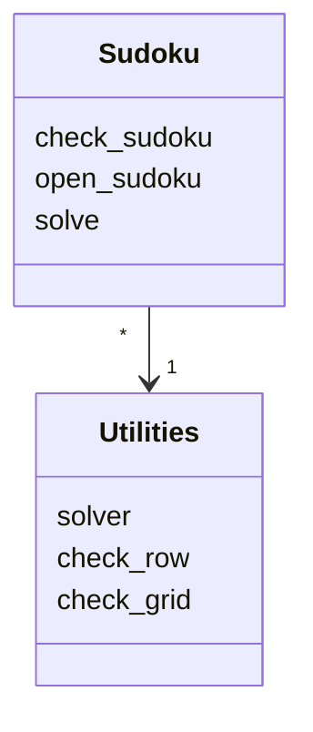
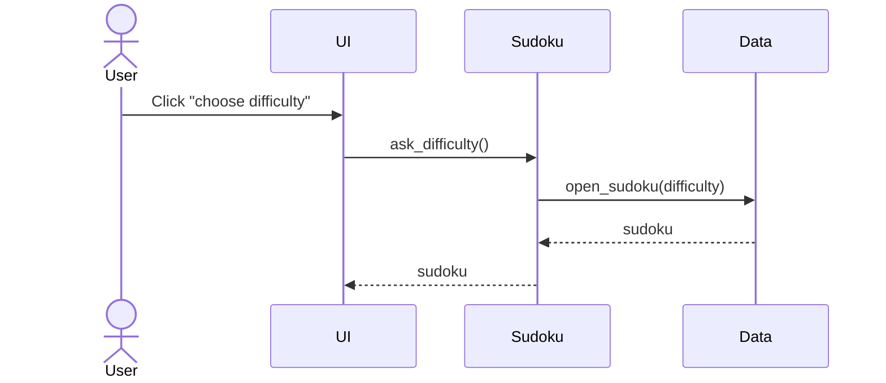
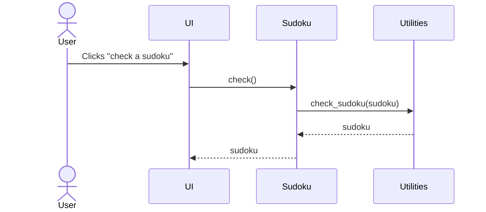

# Architechture of the application

## Structure of the application

## Logic of the program

The logic of the application is handled by the Sudoku and Utilities classes.

## Core functionalities described as sequence diagrams

### Opening a sudoku to solve

### Solving and checking the sudoku

## Data used in the application

Sudokus are loaded into the application from a CSV-file containing unsolved sudokus.
Dataset obtained from kaggle.com and a link to the complete data is found on the README.