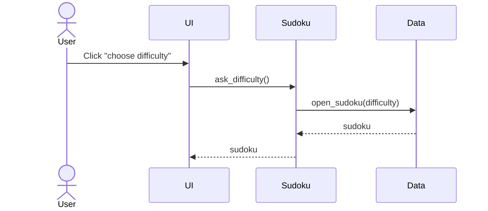
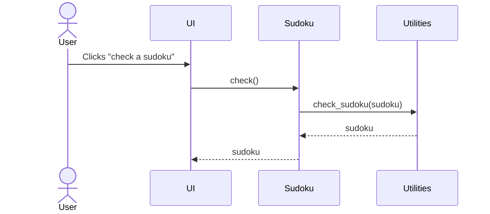

# Architechture of the application

## Structure of the application

## Logic of the program

## Core functionalities described as sequence diagrams

### Opening a sudoku to solve

### Solving and checking the sudoku

