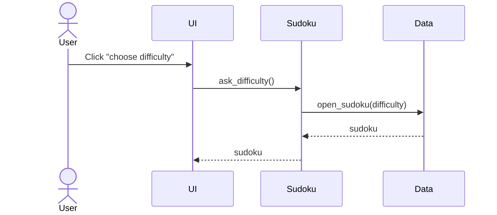

# Architechture of the application

## Core funtionalities described as sequence diagrams

### Opening a sudoku to solve

```mermaid
sequenceDiagram
  actor User
  participant UI
  participant Sudoku
  participant Data
  User->>UI: Click "choose difficulty"
  UI->>Sudoku: ask_difficulty()
  Sudoku->> Data: open_sudoku(difficulty)
  Data-->> Sudoku: sudoku
  Sudoku-->> UI: sudoku
```

### Solving and checking the sudoku

