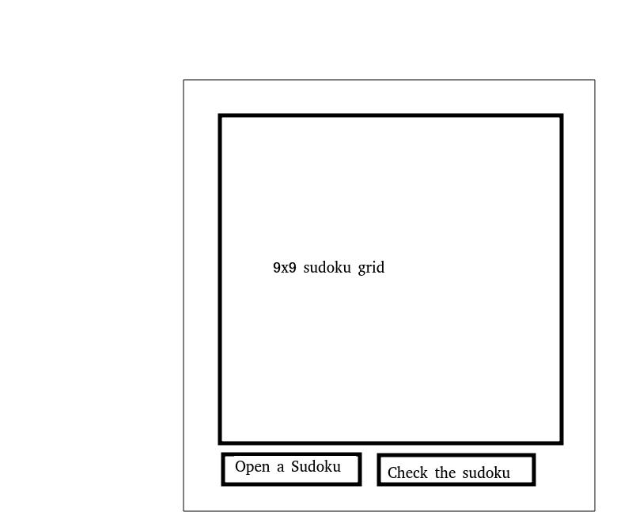

# Project Definition

## Sudoku

The aim for this application is to allow users to play sudoku.

## User Interface

Graphical user interface of the application.

The sketch above is for the minimum working version of the product and does not include the functionalities for further development.

## The Application

### Minimum working product

The minimum working version of the product allows the user to choose a sudoku, solve it and then check if the solved sudoku is correct.

### Further development

Further development of the application

- The user can create sudokus to solve in addition to using sudokus provided.
- The ability to solve sudoku's using an algorithm.
- The ability to choose different sized sudoku's to solve.
- User can choose the difficulty of the sudoku on range 1-8.
- More to come...

