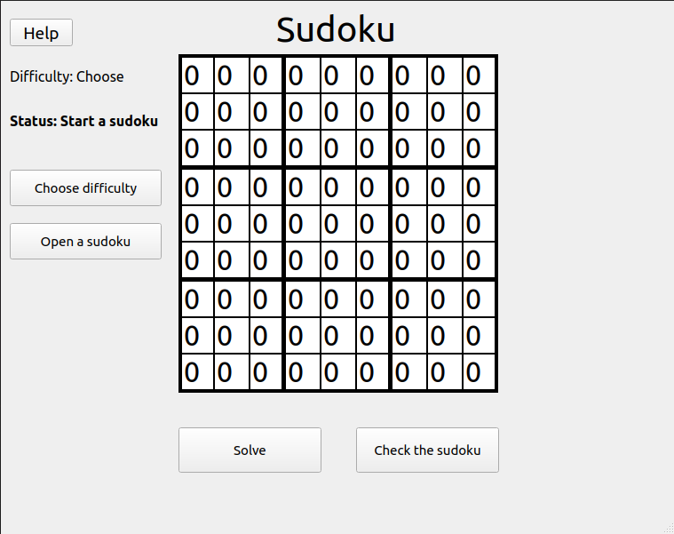

# Project Definition

## Sudoku

The aim for this application is to allow users to play sudoku and use the application as a sudoku solver if need be.

## User Interface

Graphical user interface of the application.

User Interface

## The Application

### Functionalities provided by the application

## Selecting and opening a sudoku

- Before solving the sudoku, the user must open a sudoku by first providing the desired difficulty for the sudoku.
- After providing the difficulty, the user can open a sudoku and start solving it.

## Solving the sudoku

### Manual solving
- The user has two choices when it comes to solving the sudokus.
- First one is to solve the sudokus manually by filling all the 0's with correct values

### Using the solver provided
- Second choice is to use the solver provided in the application to automatically solve the sudokus.
- User can solver using the solver and then check if the solver provided a correct solution.

## Checking the sudoku for correctness

- After the user has chosen one of the methods for solving the sudoku,
 user can check that the solution to the sudoku was correct.
 

