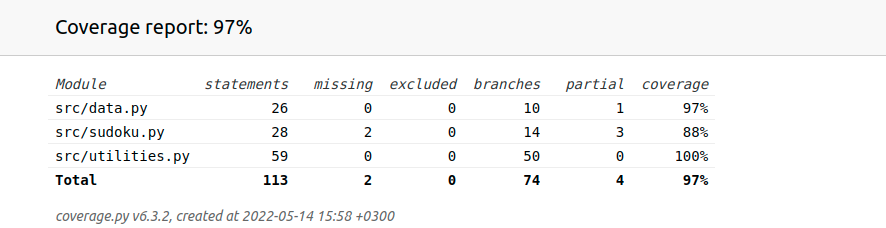

# Testing

## Unit-tests

The sudoku and utilities classes were tested with unittests by using a mock-sudoku.
The data class was only tested for the string-to-int conversion.

## Testcoverage

The coverage of the tests is 97% and it doesn't include UI testing.

## Manual testing

The application was tested manually for possible bugs and scenarios where the application might've crashed etc.
All the functionalities of the program, defined in the project definition, was tested and all the bugs discovered were addressed.

## Known problems to be fixed later

- When the sudoku to be solved takes a long time to solve using the solver, the UI freezes. This is due to the fact that the solver runs on the same thread as the UI. Fix is to run the solver on its own thread so that UI remains responsive.