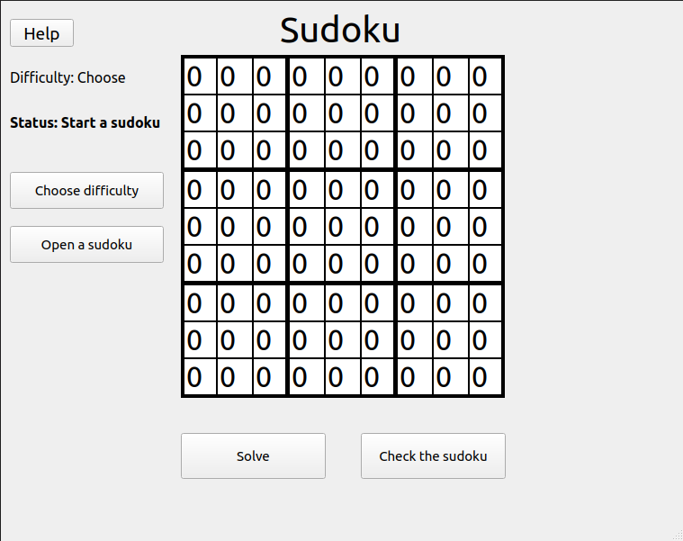
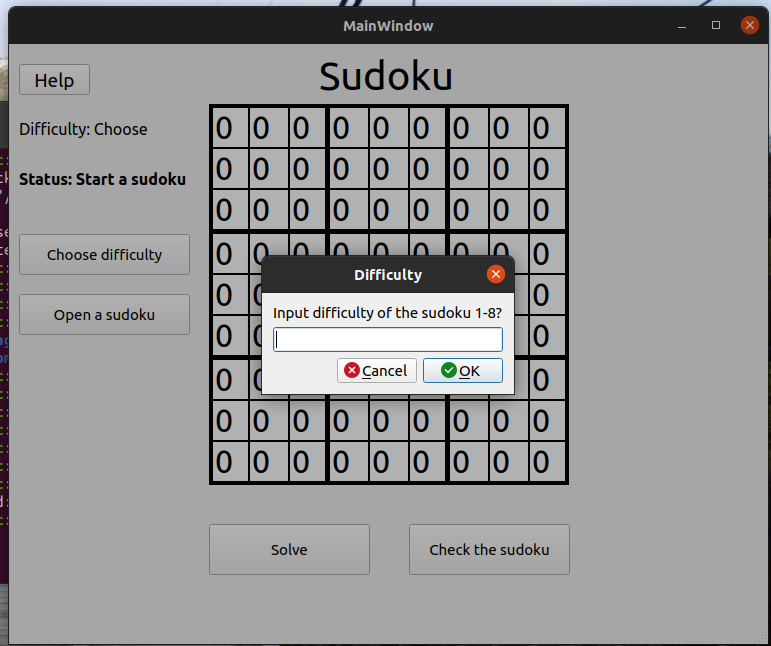
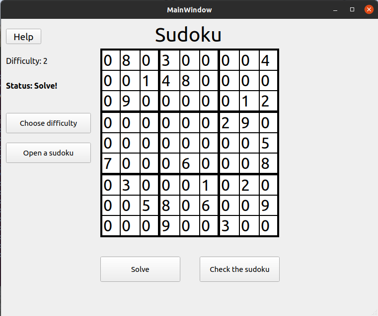
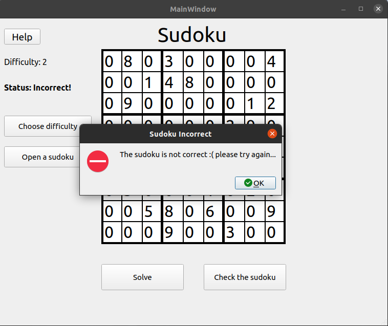

# User Guide

## Install dependencies

User must install all the required dependencies for the program to run.

Installation of dependencies is done with command

```sh
poetry install
```

## Running the program

After having installed the dependencies, the program can be started with a command

```sh
poetry run invoke start
```

## Setting up the sudoku

After starting the program the user should have the main window visible



After starting the program the first thing to do is load up a sudoku to solve or use a solver on.
- Press the "Choose difficulty" button to input the desired difficulty for the sudoku
- Input the difficulty on a scale 1-8, 8 being the hardest.



After inputting the difficulty the user should press "Open a sudoku"
A Sudoku should now be visible for the user.



## Solving

After opening a sudoku, there are two options for the user to do with the sudoku.

### Solve the sudoku using an algorithm
- User can solve the sudoku by clicking the solve button

### Solve the sudoku manually

User can start solving the sudoku manually by replacing all the 0 values with correct ones.
After having filled the whole sudoku, the user can check if the sudoku is correct by pressing the "Check the sudoku" button.


