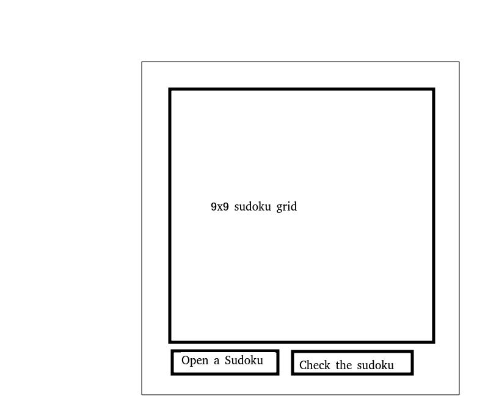

# Vaatimusmäärittely

## Sudoku

Sovelluksen tarkoituksena on mahdollistaa käyttäjälle sudokun pelaaminen.

## Käyttöliittymä

Sovelluksen graafinen käyttöliittymäluonnos.

Oheinen luonnos vastaa sovelluksen perusversiota ja ei sisällä mahdollisia jatkokehityksen tuomia toiminnallisuuksia.

## Sovellus

### Perusversio sovelluksesta

Sovellus pitää sisällään mahdollisuuden valita ja ratkoa sudokuja ja tarkistaa ratkaistujen sudokujen oikeellisuus.

### Sovelluksen Jatkokehitys

Perusversioon lisättäviä toiminnallisuuksia

- Käyttäjän mahdollista itse luoda sudokuja ratkaistavaksi.
- Mahdollisuus ratkaista sudoku tietokoneen avulla.
- Mahdollisuus valita eri kokoisia sudokuja.
- Mahdollisuus valita sudoku vaikeustason mukaan skaalalla 1-3
Lisää toiminnallisuuksia tulee kehityksen edistyessä...

